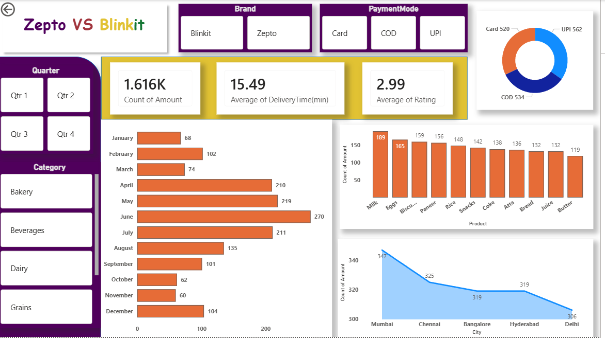

# 🛒 Zepto vs Blinkit Analysis Dashboard (Power BI)

This project analyzes and compares the performance of two quick commerce platforms — Zepto and Blinkit — using Power BI.

The dashboard focuses on sales trends, delivery performance, customer ratings, and product demand to understand business insights.

---

## 🎯 Objective

* Compare performance of Zepto and Blinkit
* Analyze sales trends across months and cities
* Evaluate delivery time and customer satisfaction
* Identify top-selling products and payment preferences

---

## 📊 Dashboard Features

* Monthly sales trend analysis
* Product-wise sales comparison
* City-wise order distribution
* Payment mode analysis (UPI, COD, Card)
* Average delivery time and rating insights

---

## 🔥 Key Insights

* Sales peak during mid-year (May–July), indicating seasonal demand
* Mumbai has the highest order volume among all cities
* Milk, Eggs, and Paneer are the most frequently ordered products
* UPI is the most preferred payment method
* Average delivery time is around 15 minutes, maintaining quick service
* Customer ratings are consistently high (~3+), indicating good satisfaction

---

## 💡 Business Insights

* Focus on high-demand cities like Mumbai for expansion
* Optimize inventory for top-selling products (Milk, Eggs, Paneer)
* Promote UPI-based offers to increase digital transactions
* Maintain low delivery time to sustain customer satisfaction

---

## 🛠 Tools Used

* Power BI
* Excel

---

## 📸 Dashboard Preview

---

## 📁 Files Included

* Power BI file (.pbix)
* Dataset
* Dashboard screenshots
